# RefconGroup Website
Website for the Refon Group
## Authors
* **Aidan Hamilton** – [Goste64](https://github.com/Goste64)
* **Jack Gronow** – [sizsan](https://github.com/sizsan)
* **Sam Harvey** – [lDoughnutl](https://github.com/lDoughnutl)
## Purpose
The purpose of this web application is to increase the Refcon Groups' online presence and to give their clients an online platform to review the products and services that are offered. The Refcon Group is a family owned business that provides their clients with affordable air-conditioning and refrigeration units. They supply, install and repair these units.

At this point in time the Refcon Group has a very basic outdated website that was created using PHP. Our goal is to replace the current site with a more modern website built with the MERN stack that is responsive and better suits the purposes of our clients business.

## Functionality / Features
The new Refcon site will consist of the following features:
#### Photo Gallery
A photo gallery will provide a way for us to keep the website minimal while also providing the user with different information.
#### Services Pages
These pages are going to allow the Refcon Groups clientele to view and request quotes on particular services. They will also act as a UI for the admin account to create, update and delete the services listed on the website.   
#### User Reviews
Users Reviews will provide a way for the Refcon Group to receive feedback from their customers as well as testimonies on their quality of work and products.

## Target Audience
The target audience for this application are the owners of commercial and residential air-conditioning and refrigeration units or put simpily the already existing clientele of the Refcon Group. 
## Tech Stack
The tech stack that we have utilised for this project is the [MERN](https://www.be-practical.com/What-is-MERN-Stack-Development.html) stack.

Frontend: [React](https://reactjs.org/)

Backend: [Node.js](https://nodejs.org/en/) and [Express.js](https://expressjs.com/)

Database: [MongoDB](https://www.mongodb.com/)

## Dataflow Diagram
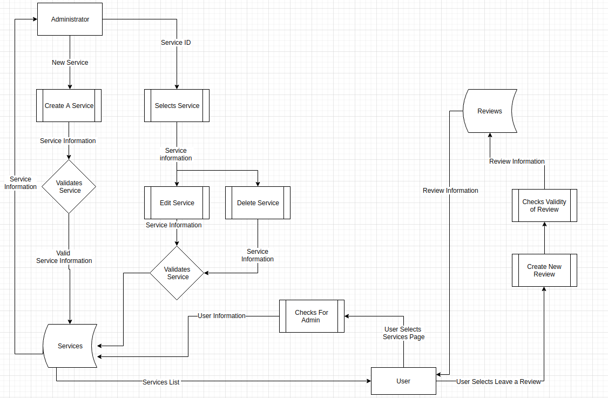
## Applicaion Architecture Diagram
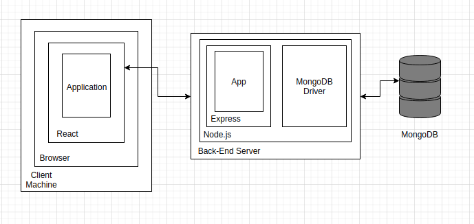
## User Stories
#### US1 - As a User I can see a list of products and services.
#### US2 - As a User I can equire about a product and/or service.
#### US3 - As a User I can view infromation about the Refcon Group.
#### US4 - As a Admin I can login/logout.
#### US5 - As a Admin I can add/edit/remove products and services. 
#### US6 - As a User I can Leave reviews/testimonials about the Refon Group.

## Wireframes 
### Desktop Home Page
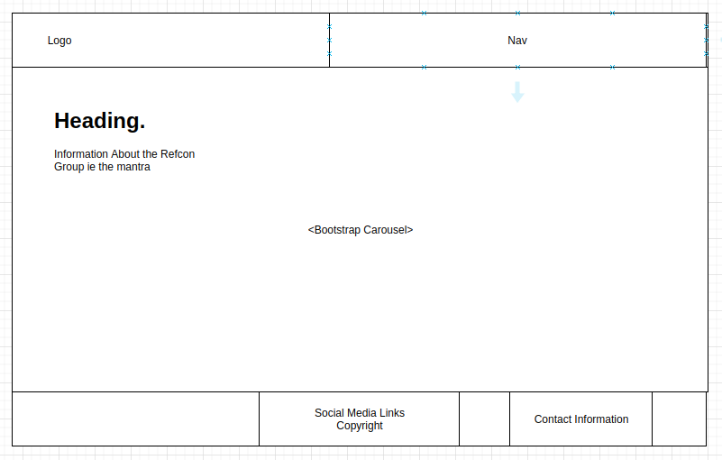
### Desktop Services Page
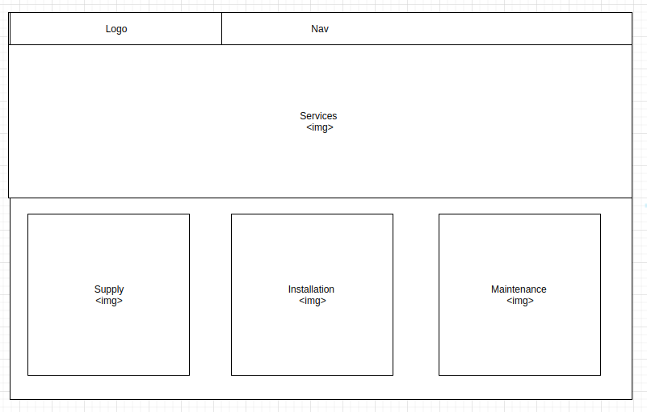
### Desktop Service Page
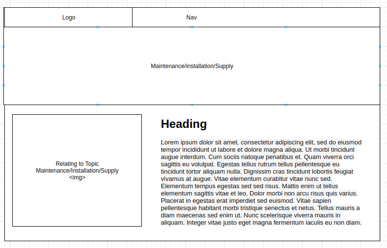
### Mobile Home Page
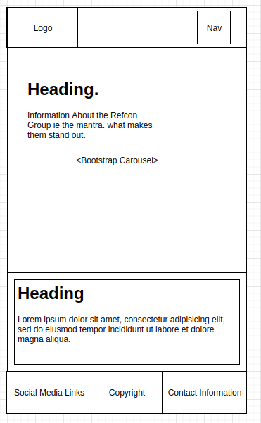
### Mobile Services Page
   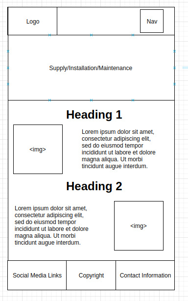

## Screenshots of your Trello board throughout the duration of the project

Week 1
Trello Monday 2 Dec 2019

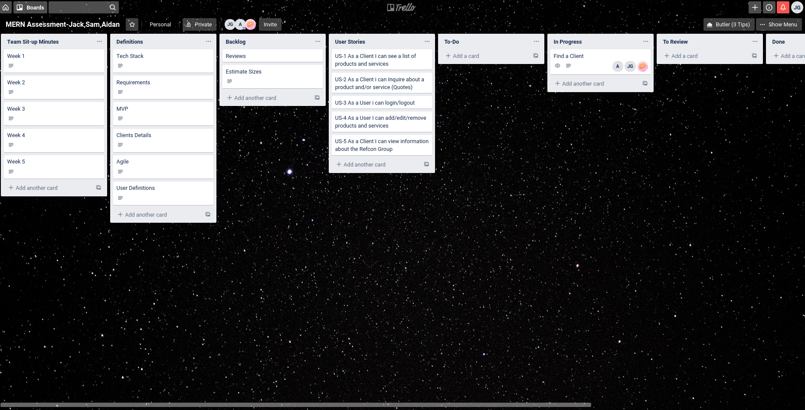

Trello Tuesday 3 Dec 2019

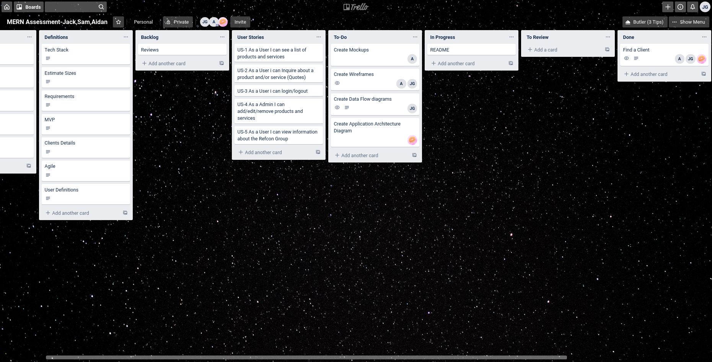

Trello Wednesday 4 Dec 2019

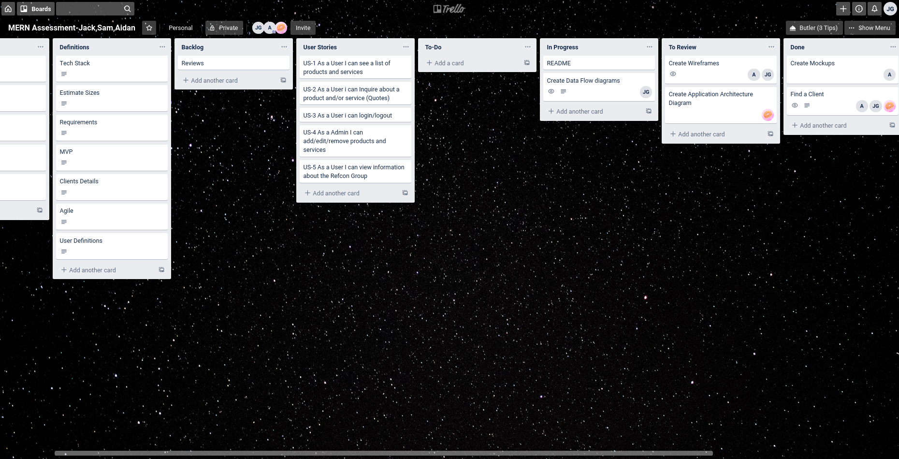

Week 2  
Trello Monday 9 Dec 2019

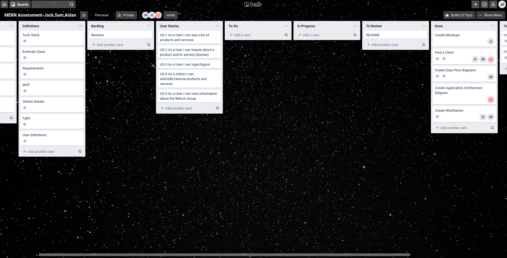

Trello Tuesday 10 Dec 2019

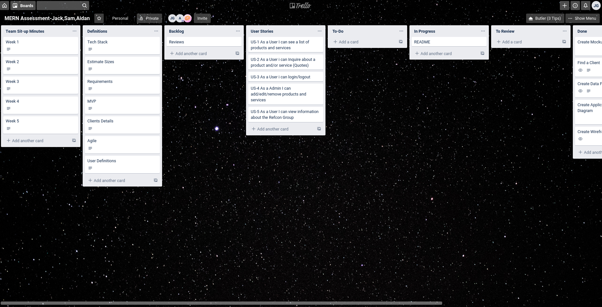

Trello Wednesday 11 Dec 2019

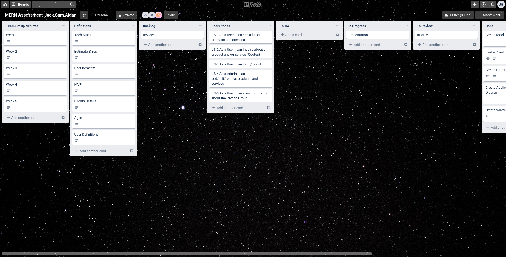

<!-- Week 3 
Trello Monday 16 Dec 2019

Trello Tuesday 17 Dec 2019

Trello Tuesday 18 Dec 2019

Week 4 
Trello Monday 13 Jan 2020

Trello Tuesday 14 Jan 2020

Trello Tuesday 15 Jan 2020

Week 5
Trello Monday 20 Jan 2020

Trello Tuesday 21 Jan 2020

Trello Tuesday 22 Jan 2020 -->