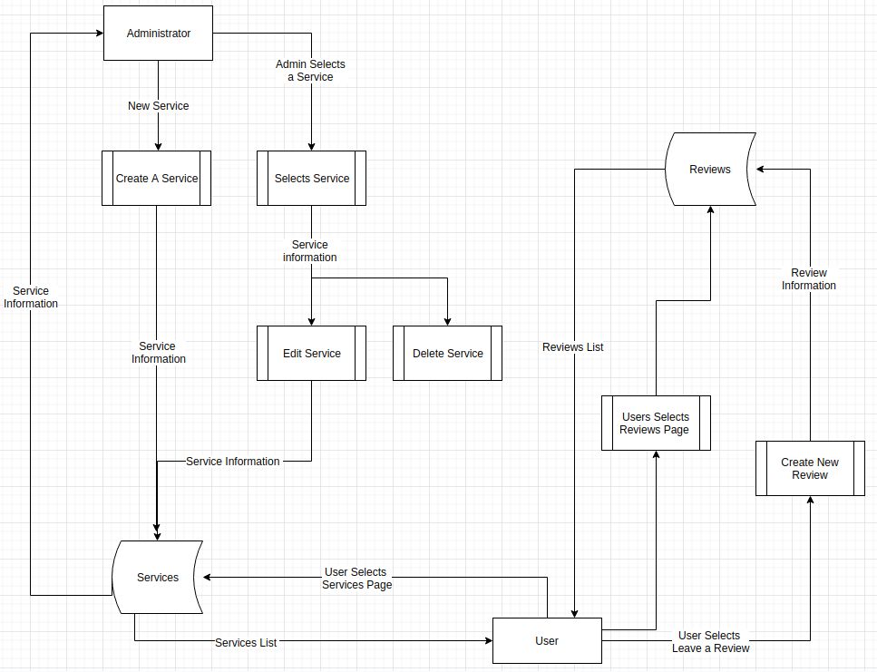

# RefconGroup Website
Website for the Refon Group
## Authors
* **Aidan Hamilton** – [Goste64](https://github.com/Goste64)
* **Jack Gronow** – [sizsan](https://github.com/sizsan)
* **Sam Harvey** – [lDoughnutl](https://github.com/lDoughnutl)
## Purpose
The purpose of this web application is to increase the Refcon Groups' online presence and to give their clients an online platform to review the products and services that are offered. The Refcon Group is a family owned business that provides their clients with affordable air-conditioning and refrigeration units. They supply, install and repair these units.

At this point in time the Refcon Group has a very basic outdated website that was created using PHP. Our goal is to replace the current site with a more modern website built with the MERN stack that is responsive and better suits the purposes of our clients business.

## Functionality / Features
The new Refcon site will consist of the following features:
#### Photo Gallery
A photo gallery alongside informational bites is an easy way to convey information in a way that the viewer can digest quickly and conviniently, which also keeps the users attention.
#### Services Pages
These pages are going to give the Refcon Group clientele the ability to view and request quotes on particular services. They will also act as a UI for the admin account to create, update and delete the services listed on the website.   
#### User Reviews
Users Reviews will provide a way for the Refcon Group to receive feedback from their customers as well as testimonies to their quality of work and products.

## Target Audience
The target audience for this application are the owners of commercial and residential air-conditioning and refrigeration units or put simpily the already existing clientele of the Refcon Group. 
## Tech Stack
The tech stack that we have utilised for this project is the [MERN](https://www.be-practical.com/What-is-MERN-Stack-Development.html) stack.

Frontend: [React](https://reactjs.org/)

Backend: [Node.js](https://nodejs.org/en/) and [Express.js](https://expressjs.com/)

Database: [MongoDB](https://www.mongodb.com/)

## Dataflow Diagram

## Applicaion Architecture Diagram

## User Stories
#### US1 - As a User I can see a list of products and services.
#### US2 - As a User I can equire about a product and/or service.
#### US3 - As a User I can view infromation about the Refcon Group.
#### US4 - As a Admin I can login/logout.
#### US5 - As a Admin I can add/edit/remove products and services. 
#### US6 - As a User I can Leave reviews/testimonials about the Refon Group.

## Wireframes 
### Desktop Home Page

### Desktop Services Page

### Desktop Service Page

### Mobile Home Page

### Mobile Services Page
   

## Trello Screenshots

### **Week 1**  
*Trello Monday 2 Dec 2019*

*Trello Tuesday 3 Dec 2019*

*Trello Wednesday 4 Dec 2019*

### **Week 2**  
*Trello Monday 9 Dec 2019*

*Trello Tuesday 10 Dec 2019*

*Trello Wednesday 11 Dec 2019*

<!-- ### Week 3 
*Trello Monday 16 Dec 2019*

*Trello Tuesday 17 Dec 2019*

*Trello Tuesday 18 Dec 2019*

### Week 4 
*Trello Monday 13 Jan 2020*

*Trello Tuesday 14 Jan 2020*

*Trello Tuesday 15 Jan 2020*

Week 5
*Trello Monday 20 Jan 2020*

*Trello Tuesday 21 Jan 2020*

*Trello Tuesday 22 Jan 2020* -->

## Planning Methodology 

For this project we selected the Kanban methodology. It is a planning framework that utilizes Agile software development. This allows us to remain flexible while also consistently completing tasks. To aid us in the application of this methodology we have implemented a trello board. 

### Assigning Tasks
Team members will consult the trello board and choose tasks to complete as they finish working on others.
### Workflow
No longer than two days will be spent on a task. If more work is required on said task another member of the team will assist in its development 
### Stand-ups
Our team will hold a stand-up at the beginning of each day that we meet.( What did you do yesterday? what are you doing today? what are you stuck on?)
### Source Control
For this project we have chosen to use a feature branch workflow. Any changes to the code will be made on their own branch and then pushed to a single repository owned by the team leader. Once the changes have been committed, a pull request will be created, and then reviewed, it is then up to the team member who reviewed it to merge it into master.
### Client Communication
Jack will be communicating with the client via phone call every Sunday when, as we have been informed, the client is available.
### Deployment 
Once a pull request has been merged into the git repository it must be deployed before anything else is.