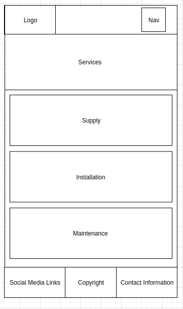

# RefconGroupSite
Website for the Refon Group
## Purpose
The purpose of this web application is to increase the Refcon groups online presence and to give their clients an online platform to review the products and services that are offered. At this point in time the Refcon Group has a very basic outdated website our goal is to redesign it to be modern and responsive.
## Functionality / Features
The functionality that was discussed for the MVP is:
- User Reviews
- Photo Gallery
- Product Pages
- Links to social medias
## Target Audience
The target auidence for this application are the owners of commerical and residential airconditioning and refrigeration units or put simpily the clientele of the Refcon Group. 
## Tech Stack
The tech stack that we have utilised for this project is the MERN stack. This stack uses MongoDB as the database, Express for the server, React for the front end and Node.js as the server enviroment. 
## Dataflow Diagram

## Applicaion Architecture Diagram

## User Stories
#### US1 - As a User I can see a list of products and services.
#### US2 - As a User I can equire about a product and/or service.
#### US3 - As a User I can view infromation about the Refcon Group.
#### US4 - As a Admin I can login/logout.
#### US5 - As a Admin I can add/edit/remove products and services. 
#### US6 - As a User I can Leave reviews/testimonials about the Refon Group.

## Wireframes 
### Desktop Home Page

### Desktop Services Page

### Desktop Service Page

### Mobile Home Page

### Mobile Services Page
   

## Screenshots of your Trello board throughout the duration of the project

Week 1
Trello Monday 2 Dec 2019

Trello Tuesday 3 Dec 2019

Trello Tuesday 4 Dec 2019

Week 2
Trello Monday 9 Dec 2019

Trello Tuesday 10 Dec 2019

Trello Tuesday 11 Dec 2019

<!-- Week 3 
Trello Monday 16 Dec 2019

Trello Tuesday 17 Dec 2019

Trello Tuesday 18 Dec 2019

Week 4 
Trello Monday 13 Jan 2020

Trello Tuesday 14 Jan 2020

Trello Tuesday 15 Jan 2020

Week 5
Trello Monday 20 Jan 2020

Trello Tuesday 21 Jan 2020

Trello Tuesday 22 Jan 2020 -->